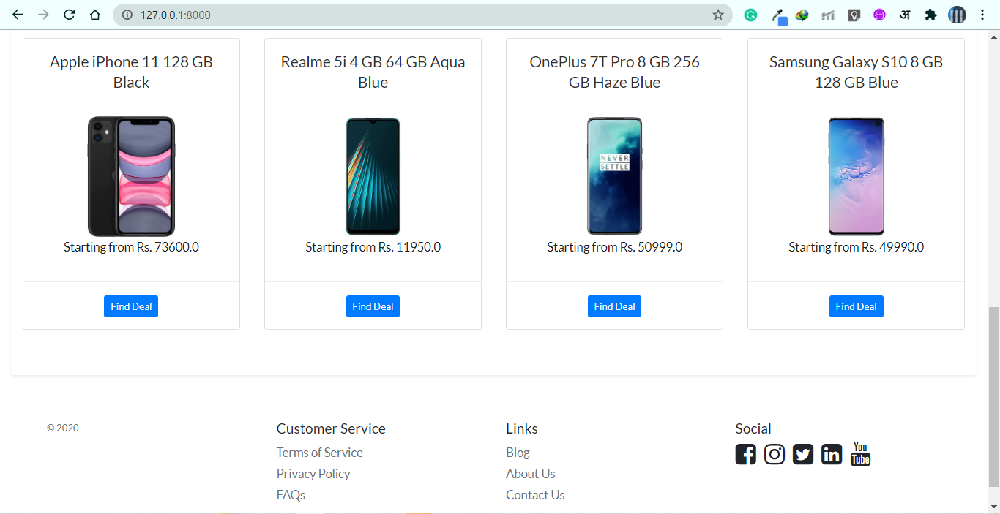
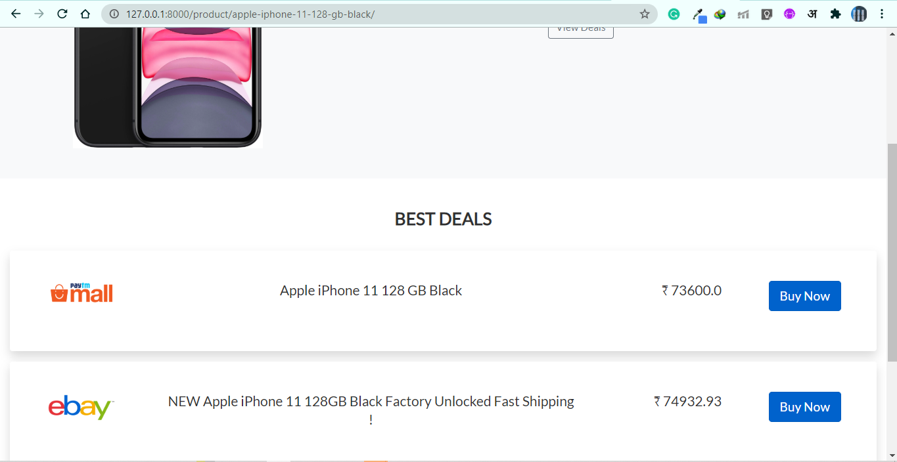

# Python Web Scraping Backend
##### scraping product_info and comparing prices through web scraping

* Web Scraping Library : Bs4 (BeautifulSoup4)
* Backend Framework : Django
> currently scraping from PaytmMall and Ebay In.

**Project Description**

*Put product urls in Views.py, a base url and ebay and paytm mall url, which will fetch product info and store it in the data models*
> *Currently, this task is not asynchronus.*

*Django Templates will fetch the data from models into front-end.*

>* create and activate the python env 
>
>*	` pip install -r requirements.txt`  *(to install libraries/dependencies)*
>* ` python manage.py runserver`
>* default admin username, password : {admin, admin}

